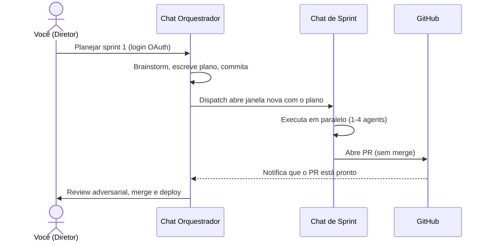

# sprint-orchestrator

> **Orquestre sprints de software com Claude:** paralelismo, isolation via git worktree, memória institucional e (em modelos menores) zero context bloat. Adaptativo a 1M ou 200k de context.

[](LICENSE)
[](https://github.com/lipefur/sprint-orchestrator/releases)
[](#status)
[](https://claude.com/claude-code)
[](CONTRIBUTING.md)
[](https://github.com/lipefur/sprint-orchestrator/discussions)
[](https://www.skills.sh)

**🌍 Idiomas:** [Português](README.md) · [English](README.en.md) · [Español](README.es.md)
**📚 Docs:** [Tutorial](docs/tutorial-getting-started.md) · [FAQ](docs/faq.md)

---

## 🤔 O problema

Você quer construir algo grande com Claude. Abre um chat. Explica o que quer. Claude começa a codar. Duas horas depois:

- 😵 O chat tá enorme. Claude esqueceu as decisões que você bateu no início.
- 🐌 Tudo acontece uma coisa por vez, mesmo quando 4 coisas podiam rodar em paralelo.
- 🔁 Você explica as mesmas convenções várias vezes.
- 💔 Bugs do sprint passado? Esquecidos. Claude cai neles de novo.

**Conhece essa situação?**

## ✨ A ideia

Pensa em construir software como fazer um filme:

| Papel | Quem |
|---|---|
| 🎬 **Diretor** (visão criativa, aprova cortes) | **Você** |
| 📋 **Produtor** (planeja, revisa, entrega) | **Chat orquestrador** (fica aberto pro projeto inteiro) |
| 🎥 **Equipes de filmagem** (cada uma grava uma cena) | **Chats de sprint** (um por feature, criado e descartado) |

Você não filma cada quadro. Você **dirige**, o produtor **planeja e revisa**, as equipes **executam em paralelo**.

É isso. É essa a skill.




## 🎯 Antes / Depois

| | **Sem essa skill** | **Com essa skill** |
|---|---|---|
| **Estrutura do chat** | 1 chat gigante que esquece contexto | 1 orquestrador + N chats de sprint focados |
| **Decisões** | Tomadas no início, perdidas depois | Capturadas em planos, commitadas no git |
| **Paralelismo** | Uma coisa por vez | 1-4 agents por sprint, múltiplos sprints possíveis |
| **Memória entre sprints** | Nenhuma | `state.md` + `bug-patterns.md` por addon |
| **Controle de qualidade** | Você lê cada PR manualmente | Claude adversarial revisa primeiro, você arbitra |
| **Validação** | "Funciona na minha máquina" | GitHub Action faz preview deploy + Playwright automático |
| **Lições aprendidas** | Perdidas no histórico do chat | Capturadas como bug patterns após cada deploy |

## 👥 Pra quem é essa skill

- **Devs usando Claude Code todo dia** em projetos reais (não só demos)
- **Founders solo / indie hackers** construindo produtos multi-feature
- **Times pequenos** que querem workflow estruturado com IA
- **Quem tem múltiplos repos** querendo processo consistente entre eles

**Não é pra:** scripts de uso único, protótipos descartáveis, "só conserta esse typo". Pra isso, usa Claude direto.

## 🚀 Instalação

**Via `npx skills` (recomendado — cross-agent: Claude Code, Cursor, Codex, Windsurf, +50):**

```bash
npx skills add lipefur/sprint-orchestrator
```

**Via installer dedicado (Claude Code, com check de dependências):**

```bash
curl -fsSL https://raw.githubusercontent.com/lipefur/sprint-orchestrator/main/install.sh | bash
```

O installer verifica dependências, clona a skill pra `~/.claude/skills/sprint-orchestrator/` e mostra próximos passos.

<details>
<summary>Outros métodos de instalação (manual / revisar antes / local customizado)</summary>

**Revisar o installer antes:**

```bash
curl -fsSL https://raw.githubusercontent.com/lipefur/sprint-orchestrator/main/install.sh -o /tmp/install.sh
less /tmp/install.sh        # inspeciona
bash /tmp/install.sh
```

**Clone direto (sem installer):**

```bash
git clone https://github.com/lipefur/sprint-orchestrator.git ~/.claude/skills/sprint-orchestrator
```

**Local customizado:**

```bash
SPRINT_ORCHESTRATOR_DIR=/custom/path bash install.sh
```

**Atualizar depois:**

```bash
curl -fsSL https://raw.githubusercontent.com/lipefur/sprint-orchestrator/main/install.sh | bash -s -- update
```

</details>

## 📖 Quickstart (3 passos)

### 1. Setup do projeto (uma vez)

```bash
cd path/para/seu/projeto
bash ~/.claude/skills/sprint-orchestrator/scripts/init.sh
```

O script inspeciona seu repo, detecta sua stack (Postgres? Next.js? Monorepo?), pergunta umas coisas e escreve `.sprint-orchestrator.yml`.

### 2. Planejar um sprint

Abre Claude Code no seu projeto. Diz:

> "Vamos planejar sprint 1 — implementar login com OAuth"

Claude faz brainstorming com você, escreve um plano detalhado, commita em `main`.

### 3. Dispatchar o sprint

```bash
bash ~/.claude/skills/sprint-orchestrator/scripts/create-worktree.sh 1 oauth-login
```

Uma **nova janela do Claude Code abre**, já rodando num worktree isolado com o plano carregado. Executa autonomamente, abre PR, e volta pra você revisar.

É isso. Walkthrough completo: [docs/tutorial-getting-started.md](docs/tutorial-getting-started.md).

---

# Resumo técnico

Pra quem quer entender a arquitetura antes de instalar.

## Como funciona por baixo

A skill é estruturada como **markdown modular** que Claude lê sob demanda:

```
sprint-orchestrator/
├── SKILL.md             # entry point — Claude sempre lê
├── core/                # workflow + anti-padrões universais + style de commits
├── addons/              # stack-specific (carrega só se profile ativa)
├── templates/           # templates de plano por tipo, prompt dispatch, memory
├── checklists/          # pre-dispatch, post-pr-review, deploy-prod, capture-learnings
└── scripts/             # init.sh, create-worktree.sh (multi-IDE dispatch)
```

Quando você invoca a skill no Claude Code:

1. Claude lê `.sprint-orchestrator.yml` do seu projeto
2. Carrega `core/` (universal)
3. Carrega só os `addons/` que seu projeto usa (ex: `postgres`, `nextjs`)
4. Consulta templates/checklists just-in-time por fase

Resultado: **~6-12k tokens de contexto** mesmo com todos os addons ativos.

## O workflow em 4 fases

```
┌─────────────────────────────────┐
│  CHAT ORQUESTRADOR (você fica)  │
│  1. PLAN — brainstorm + plano   │
│  2. DISPATCH — cria worktree    │
│              + abre chat novo   │
└─────────────────────────────────┘
              ↓
┌─────────────────────────────────┐
│  CHAT DE SPRINT (Claude novo)   │
│  3. EXECUTE — lê plano, coda,   │
│     testa, abre PR, update state│
└─────────────────────────────────┘
              ↓
┌─────────────────────────────────┐
│  VOLTA PRO ORQUESTRADOR         │
│  4. REVIEW + DEPLOY             │
│     (com checks automáticos)    │
└─────────────────────────────────┘
```

## Configuração (um arquivo por projeto)

`.sprint-orchestrator.yml` na raiz do projeto (gerado pelo `init.sh`):

```yaml
version: 1
project_name: meu-app
default_branch: main

paths:
  plans: docs/superpowers/plans
  worktrees: .claude/worktrees

addons: [postgres, nextjs, e2e-validation, github-actions]

dispatch:
  method: auto      # auto-detect IDE (Cursor, VS Code, Claude Code, etc.)

notifications:
  github_assignee: meu-username      # auto-assigned no PR
  github_label: ready-for-review

# Workflows avançados (opt-in)
adversarial_review:
  enabled: true                       # 3º Claude revisa PRs adversarialmente
  reviewer_model: sonnet

github-actions:
  preview_validation: true            # preview deploy + Playwright auto no PR
  preview_platform: vercel            # vercel | fly | railway | coolify | generic
```

## Workflows avançados

Três workflows opt-in que elevam o fluxo básico:

### 🤖 Adversarial review

Quando o chat de sprint abre PR, um **3º Claude isolado** é dispatchado como reviewer com prompt explícito: *"encontre problemas que o implementer perdeu."* Posta comments via `gh pr review`. Você vira **arbitrador**, não reviewer linha-por-linha.

→ [`core/adversarial-review.md`](core/adversarial-review.md)

### 🚀 Preview deploy + auto-validation

Templates de GitHub Action pra Vercel/Fly/Railway/Coolify. Quando PR abre: sobe preview deploy, roda Playwright contra URL preview, posta comment estruturado com PASS/FAIL + screenshots. Orquestrador acorda via GitHub notification — **sem polling**.

→ [`addons/github-actions/preview-validation/`](addons/github-actions/preview-validation/)

### 🧠 Capture learnings

Após cada deploy, orquestrador triagia commits `fix:` do sprint e propõe novos bug patterns pra adicionar nos addons. A skill **evolui com o uso** em vez de ficar estática.

→ [`checklists/capture-learnings.md`](checklists/capture-learnings.md)

### 🎛️ Modos adaptativos (1M / 200k)

A skill detecta seu context window (perguntado no `init.sh`) e escolhe:

- **monolithic** (1M / Opus 4.6+/4.8) — orquestrador + execução no mesmo chat. Menos handoff. Worktree mantido; subagents só pra áreas disjuntas.
- **split** (200k / Sonnet / Foundry) — 2 chats separados. Comportamento clássico.

`mode: auto` decide por context window + tamanho do sprint, anuncia a decisão e aceita veto. Override fixo via `model.mode` no profile. Profile antigo sem `model:` → split (backward compat). Detalhes em `core/workflow.md`.

### 📊 Visual dashboard

Kanban board local renderizado a partir do `state.md`. Três modos:

```bash
bash <skill>/scripts/dashboard.sh              # HTML estático, abre no browser
bash <skill>/scripts/dashboard.sh --serve      # live server com auto-refresh (SSE)
bash <skill>/scripts/dashboard.sh --workspace  # multi-project a partir de ~/.config/sprint-orchestrator/workspace.yml
```

Roda 100% local, **zero tokens Claude**. Vê tudo de relance: sprints por fase, PRs abertos com labels, recent merges.

→ [`scripts/dashboard/`](scripts/dashboard/)

## Suporte multi-IDE

O script de dispatch **detecta seu ambiente automaticamente** e adapta:

| Ambiente | Comportamento |
|---|---|
| **Claude Code standalone** (Terminal/iTerm) | URL scheme `claude-cli://` abre nova janela com prompt pré-carregado |
| **Cursor** | Abre worktree no Cursor + copia prompt → ⌘L pra nova chat |
| **VS Code** + Claude extension | Abre worktree no VS Code + copia prompt → comando "Claude: New Chat" |
| **Antigravity** (Google) | Copia prompt + instrução + working dir |
| **Windsurf** (Codeium) | Abre worktree no Windsurf + copia prompt → nova Cascade chat |
| **Outros** | Clipboard puro + arquivo temp com prompt |

Sobrescreve por projeto via `dispatch.method` no profile.

## Como difere de alternativas

| Abordagem | Trade-off |
|---|---|
| **Chat longo único** | Context bloat, sem paralelismo, sem memória entre sprints |
| **`superpowers:executing-plans`** | Bom pra executar plano conhecido em uma sessão; não orquestra fluxo multi-sprint |
| **TODO list / Notion** | Sem anti-padrões aprendidos; sem automação de dispatch + review |
| **Esta skill** | Workflow multi-chat, addon-modular, estado persistente, validado em produção |

## Status

**v1.2.0** (atual): fundação + workflows avançados + installer one-liner + dashboard visual + modos adaptativos (1M/200k).

**Roadmap (v2.0):**

- Bug patterns split por addon (a maioria são placeholders hoje — maior gap)
- Mais profiles de exemplo (Next.js+Vercel, Django, monolito simples)
- Scripts de cleanup (`cleanup-merged.sh`, `list-sprints.sh`)
- Checklist de recovery pra sprint travado
- Template de kickoff pra projetos novos
- Implementação de scheduled task (pra projetos sem GitHub Actions)

## Contribuindo

Contribuições mais valiosas:

- 🧠 **Bug patterns** do seu debugging real em produção → ver [template de issue bug-pattern](.github/ISSUE_TEMPLATE/bug-pattern.md)
- 🧩 **Addons novos** pra sua stack (Rails, Django, Spring, Go, etc.) → ver [CONTRIBUTING.md](CONTRIBUTING.md)
- 📋 **Perfis de exemplo** em `examples/`
- 🌍 **Traduções** deste README

## Licença

MIT — ver [LICENSE](LICENSE). Faz fork à vontade.

## Origem

Construída e validada em 17+ sprints de produção entre Maio/2026 e o release público — em um projeto BaaS multi-tenant em produção. Ver [`examples/multi-tenant-saas-profile.yml`](examples/multi-tenant-saas-profile.yml) pra um perfil real anonimizado.
